## Data Mining Final Project - K-Means Clustering

- <small>組別：第17組 學號：40947075s 姓名：張睿恩</small>
- <small>專案 [Github repo](https://github.com/Imp1ication/data_mining_final_project-.git)</small>

> 註：如果覺得pdf中的排版不甚美觀，可以到上方Github repo連結查看Markdown報告的網頁版。

---

### 零、主要檔案

| 檔案名稱                                               | 說明                    |
| ------------------------------------------------------ | ----------------------- |
| data.csv                                               | 資料集                  |
| [kmeans_analyze.py](kmeans_analyze.py)                 | K-Means類別性能分析腳本 |
| [cluster_analyze.py](cluster_analyze.py)               | 資料集分群分析腳本      |
| [scripts/kmeans.py](scripts/kmeans.py)                 | K-Means類別實做         |
| [scripts/kmeans_example.py](scripts/kmeans_example.py) | K-Means類別使用範例     |

### 一、專題實作目的

#### 1. K-Means Clustering

實做 K-Means 演算法，並探討在不同策略下的分群效能：

- 比較使用不同初始化簇中心方法的分群性能，包含`random`與`kmean++`。

- 比較使用不同迭代方法的分群性能，包含`Lloyd's Algorithm`與`Elkan's Algorithm`。

- 比較不同`k`值下的分群效果。

#### 2. 透過 K-Means 分群，觀察音樂特徵與歌曲的流行程度的相關性

透過 K-Means 將歌曲分為不同的群集， 藉此觀察不同群集中歌曲的共同特點，並進一步分析這些特點是否與歌曲的流行程度（On chart）有相關性。

---

### 二、資料集特徵說明、屬性特性說明

#### 資料集：[Hit song science - 34740 songs (+spotify features)](https://www.kaggle.com/datasets/multispiros/34740-hit-and-nonhit-songs-spotify-features/data)

這份資料集蒐集了一組關於歌曲是否流行的資料，總共包含17425首熱門歌曲（曾經在Billboard、Shazam或Spotify的100位排行榜上至少出現過一次），以及17315首非熱門歌曲（這些歌曲從未在這三個來源的100位排行榜上出現過）。

每筆資料都包含了以下特徵：

- 歌曲資訊

  這些特徵提供了對歌曲身份的基本了解，例如歌曲的獨特標識符、演唱者和是否曾在流行榜上取得過成就，在本次專題中，我將只取用`on_chart`來做為目標特徵參與分析。

  | 特徵名稱    | 特徵說明                                   | 特徵屬性          | 數據類型 |
  | ----------- | ------------------------------------------ | ----------------- | -------- |
  | track_title | 歌曲名稱                                   | Unique Identifier | Nominal  |
  | artist_name | 藝人名稱                                   | Categorical       | Nominal  |
  | track_id    | Spotify生成的歌曲ID                        | Unique Identifier | Nominal  |
  | on_chart    | 流行榜指標，1表示熱門歌曲，0表示非熱門歌曲 | Binary            | Nominal  |

- 歌曲結構

  這些特徵揭示了歌曲在結構和節奏方面的特點，有助於理解歌曲基本元素間的關聯以及可能影響其是否流行的結構性因素。

  | 特徵名稱       | 特徵說明                                                                 | 特徵屬性     | 數據類型 |
  | -------------- | ------------------------------------------------------------------------ | ------------ | -------- |
  | duration_ms    | 歌曲持續時間（毫秒）                                                     | Quantitative | Ratio    |
  | time_signature | 預測的拍號，通常為4（四分之四拍）                                        | Categorical  | Ordinal  |
  | tempo          | 曲速，通常在50到150之間的浮點數                                          | Quantitative | Ratio    |
  | key            | 調性（所有八度上的音調，以0到11的數值編碼，以C為0開始，C#為1，以此類推） | Categorical  | Ordinal  |
  | mode           | 調性的模式（Minor: 0, Major: 1）                                         | Binary       | Nominal  |
  | loudness       | 音量，通常在-60到0之間的浮點數                                           | Quantitative | Ratio    |

- 音樂特性（皆為0到1之間的浮點數）

  這一類特徵更著重於歌曲的音樂風格元素，包括情感表達、樂器使用和聲學特性，這些元素通常是影響歌曲吸引力的重要因素。

  | 特徵名稱         | 特徵說明                                                               | 特徵屬性     | 數據類型 |
  | ---------------- | ---------------------------------------------------------------------- | ------------ | -------- |
  | energy           | 能量指標，值越高表示能量越強                                           | Quantitative | Ratio    |
  | danceability     | 歌曲的舞動性，值越高表示越容易舞動                                     | Quantitative | Ratio    |
  | valence          | 歌曲的情感傾向，越高表示越愉悅                                         | Quantitative | Ratio    |
  | liveness         | 表演的現場感，越高表示越接近現場演出                                   | Quantitative | Ratio    |
  | instrumentalness | 樂器音的程度，越高表示越接近純音樂，反之則更可能帶有人聲               | Quantitative | Ratio    |
  | acousticness     | 歌曲的聲學性質，越高原聲樂器的佔比就越高，反之則表示歌曲可能更加電子化 | Quantitative | Ratio    |
  | speechiness      | 歌曲中包含的言語成分，越高表示音檔越可能屬於講座、朗讀一類非歌曲音檔   | Quantitative | Ratio    |

這裡我將特徵根據其特性分成了歌曲資訊、歌曲結構、以及音樂特性三類。這樣的分類有助於我們在分析歌曲流行程度時能更有針對性地探索不同特徵的影響，以了解歌曲成功的可能因素。

---

### 三、程式/環境設定，執行方式說明

#### 程式/環境設定

請先確保您的系統中存在可用的Python 3環境，並且已經安裝以下套件：

```
numpy
pandas
dataclasses
matplotlib
scikit-learn
```

或者，您也可以執行以下指令一次安裝所需套件：

```bash
$ pip install -r requirements.txt
```

---

#### 執行方式

> 請注意，這些腳本可能需要較長的時間執行，取決於您的硬體性能。

1. K-Means 類別性能分析腳本：

   如果環境允許，您可以直接執行`kmeans_analyze.py`，或者，您也可以執行以下指令：

   ```bash
   $ python3 kmeans_analyze.py
   ```

   腳本執行完成後，會在`outputs/`目錄下生成一個`kmeans_analyze/`資料夾，它包含了在不同策略下的分群效能分析圖表，關於圖表的內容，將會在後續的報告中說明。

2. Hit song science 分群分析

   如果環境允許，您可以直接執行`cluster_analyze.py`，或者，您也可以執行以下指令：

   ```bash
   $ python3 cluster_analyze.py
   ```

   腳本執行完成後，會在`outputs/`目錄下依序生成`structure_features`、`music_features`、及`all_features/`三個資料夾，它們分別包含了在不同特徵集下的分群結果，關於這些結果的內容，將會在後續的報告中說明。

---

### 四、採用Data Mining 模組

- `sklearn.preprocessing.MinMaxScaler`：我使用`MinMaxScaler`來將所有特徵的數值縮放到0到1之間，以便於後續的聚類分析，關於使用的原因，將在下一段「五、資料集前處理」中說明。

由於我的專題內容主要為K-Means演算法的實作與分析，所以我並沒有使用到太多現成的Data Mining模組。

---

### 五、資料集前處理

#### 檢查缺失值

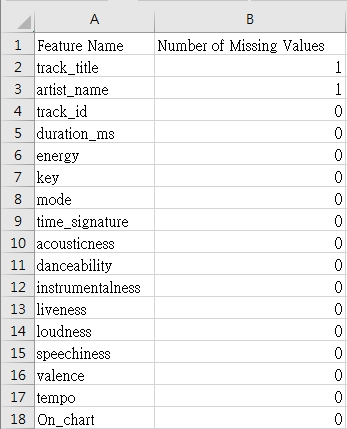

從上表可以看出，只有`track_title`和`artist_name`中存在缺失值，但由於在後續的分析中我不打算使用這兩個特徵，所以在這理我並不打算特別對其進行處理。

---

#### 特徵刪減

- 去除`track_title`、`artist_name`、和`track_id`：由於我想探討的是歌曲本身的要素對於歌曲是否流行的影響，所以這裡不考慮歌曲的名稱和演唱者，而`track_id`則是一個獨特的識別符，對於歌曲是否流行並無實質性的影響，所以我決定在這裡將它們去除。

---

#### 特徵縮放

MinMax Scaling：由於資料集中的特徵數值範圍不一，所以我採用`MinMaxScaler`將所有特徵的數值縮放到0到1之間，使用`MinMaxScaler`的原因如下：

- 對於大部分特徵而言，它們的數值範圍都是0到1之間，所以我認為將所有特徵都縮放到這個範圍內，可以讓我們更好地觀察特徵間的差異。

- 對於「歌曲結構」中的特徵，尤其`time_signature`和`key`這兩個屬於Ordinal的特徵，為了保留其順序性與相對大小的關係，我認為`MinMaxScaler`是一個比較適合的選擇。

---

### 六、K-Means 類別實做

在本次實做中，我實現了一個K-Means聚類演算法的Python類別，該類別詳細說明如下：

#### 類別參數

以下是 K-Means 類別的初始化參數，它們均為可選項，並且都具有可用的預設值：

| 參數           | 說明                                                                               | 預設值   |
| -------------- | ---------------------------------------------------------------------------------- | -------- |
| `n_clusters`   | Cluster的數目。                                                                    | 5        |
| `max_iter`     | 最大迭代次數。                                                                     | 300      |
| `n_init`       | 運行K-Means算法的次數，每次使用不同的隨機種子進行初始化，最終選擇有最小SSE的結果。 | 1        |
| `init_method`  | 初始化中心的方法，支援 `random` 和 `kmeans++` 兩種方法。                           | "random" |
| `algorithm`    | 迭代算法，支援 `lloyd` 和 `elkan` 兩種方法。                                       | "lloyd"  |
| `tolerance`    | 收斂閾值，當兩次連續迭代的SSE差異小於閾值時，將視為以收斂並結束迭代。              | 1e-4     |
| `random_state` | 亂數種子，以確保結果的可重複性。                                                   | None     |
| `n_jobs`       | 用於平行處理的作業數目。若為0，將使用所有處理器，若為1，則不額外做平行處理。       | 1        |

---

#### 內部方法

K-Means 類別實現了多個內部方法，以協助實現 K-Means 算法的不同階段：

| 方法名稱                                                          | 說明                                                                             |
| ----------------------------------------------------------------- | -------------------------------------------------------------------------------- |
| `_init_centers(data)`                                             | 根據初始化方法（`random`或`kmeans++`）呼叫對應的內部函式初始化聚類中心。         |
| `_kmeans_plusplus_init(data)`                                     | 使用`kmeans++`方法初始化聚類中心。                                               |
| `_assign_with_lloyd(data, centers)`                               | 使用`Lloyd`算法分配數據點到最近的聚類中心。                                      |
| `_assign_with_elkan(data, centers)`                               | 使用`Elkan`算法分配數據點到最近的聚類中心。                                      |
| `_assign_to_closest_center(data, centers)`                        | 根據指定的算法（`Lloyd`或`Elkan`）呼叫對應的內部函式分配數據點到最近的聚類中心。 |
| `_assign_to_closest_parallel(data, centers, func)`                | 平行處理數據分配操作。                                                           |
| `_update_cluster_centers(data, centers, cluster_result)`          | 更新聚類中心。                                                                   |
| `_update_cluster_centers_parallel(data, centers, cluster_result)` | 平行處理更新聚類中心。                                                           |
| `_calc_sse(data, centers, cluster_result)`                        | 計算SSE（誤差平方和）。                                                          |

---

#### 外部方法

K-Means 類別提供了兩個主要的外部方法，用於實際進行 K-Means 聚類：

| 方法名稱            | 說明                                                      |
| ------------------- | --------------------------------------------------------- |
| `fit(data)`         | 對輸入的數據進行K-Means算法，返回`KMeansResult`資料類別。 |
| `kmeans_once(data)` | 單次執行K-Means算法，返回`KMeansResult`資料類別。         |

---

#### KMeansResult 資料類別

為方便組織 K-Means 算法的結果，我使用了 Python 的`dataclass`裝飾器，定義了名為`KMeansResult`的資料類別。這個類別用於封裝 K-Means 算法的執行結果，包括聚類中心、分配結果、SSE、平均 SSE、執行時間、以及迭代次數。

| 參數             | 說明                           | 預設值 |
| ---------------- | ------------------------------ | ------ |
| `centers`        | 最終的聚類中心。               | -      |
| `cluster_result` | 每個數據點被分配到的聚類索引。 | -      |
| `sse`            | 最終的SSE（誤差平方和）。      | 0.0    |
| `avg_sse`        | 多次執行時的平均 SSE。         | 0.0    |
| `run_time`       | 單次執行的執行時間。           | 0.0    |
| `iter_count`     | 單次執行的迭代次數。           | 0      |

#### 使用範例

```python=
# 引用類別
import numpy as np
import kmeans  # 將 kmeans.py 放在同一個目錄下

# 範例數據
data = np.array([[1, 2], [5, 8], [1.5, 1.8], [8, 8], [1, 0.6], [9, 11]])

# 初始化類別
kmeans_cluster = kmeans.KMeans(
    n_clusters=3,
    n_init=5,
    init_method="kmeans++",
    algorithm="lloyd",
    random_state=17,
)

# 執行K-Means clustering
result = kmeans_cluster.fit(data)

# 印出結果，四捨五入至小數點後第二位
print(f"資料集：\n{np.round(data, 2)}\n")
print(f"最佳聚類中心：\n{np.round(result.centers, 2)}\n")
print(f"最佳分配結果：\n{result.cluster_result}\n")
print(f"最佳SSE值： {round(result.sse, 2)}")
print(f"平均SSE值： {round(result.avg_sse, 2)}\n")
print(f"算法執行時間： {round(result.run_time, 2)} 秒")
```

輸出結果：

```
資料集：
[[ 1.   2. ]
 [ 5.   8. ]
 [ 1.5  1.8]
 [ 8.   8. ]
 [ 1.   0.6]
 [ 9.  11. ]]

最佳聚類中心：
[[5.   8.  ]
 [8.5  9.5 ]
 [1.17 1.47]]

最佳分配結果：
[2 0 2 1 2 1]

最佳SSE值： 6.31
平均SSE值： 6.31

算法執行時間： 0.05 秒
```

---

### 七、K-Means 性能分析

#### 比較`random`與`kmeans++`初始化方法的分群性能

1. K-Means 參數設置

   | 參數          | 說明                                                                                                         |
   | ------------- | ------------------------------------------------------------------------------------------------------------ |
   | `n_clusters`  | 設定為2~15，以探索不同`k`值下`random`與`kmeans++`對K-Means的性能影響與差異。                                 |
   | `n_init`      | 為了觀察隨機初始化對結果的影響，我分別將其設定為1，5和10，並選取執行多次K-Means的最佳及平均SSE值為最終結果。 |
   | `init_method` | 為比較`random`與`kmeans++`的差異，分別設定為這兩種方法。                                                     |

2. 不同k值下的分群效果

   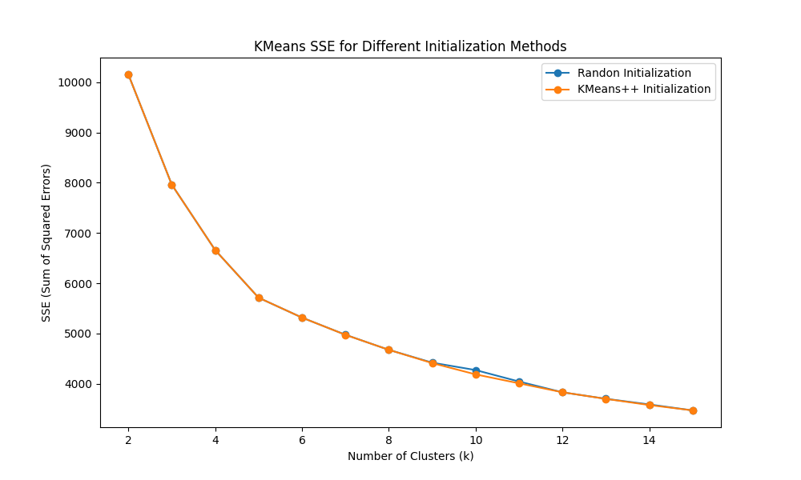

   上圖展示了在不同`k`值下，使用`random`和`kmeans++`初始化方法，`n_init = 10`時的最佳SSE值。從圖中我們可以觀察到`random`與`kmeans++`在最佳SSE值上的差異並不明顯，這一方面可能是因為資料集本身的特性，其資料點的分佈較為明確導致兩者最佳的分群結果近似；另一方面，也可能是因為`n_init = 10`便能大致消除隨機初始化所導致的影響，使兩者都能得到最佳的分群結果。

   不過，從圖中我們也可以觀察到，幾乎在所有時候，`kmeans++`都能得到比`random`更小的SSE值，這說明了`kmeans++`初始化方法確實有著比`random`更好的效果。

   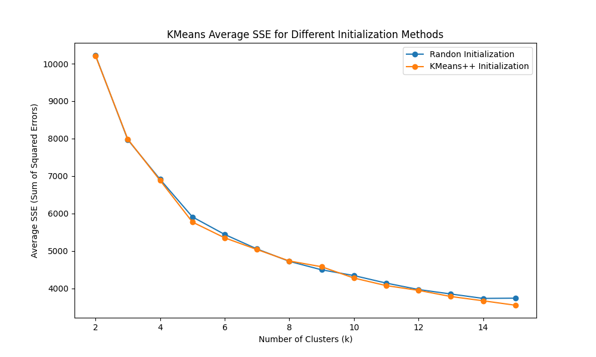

   上圖呈現的是`n_init = 10`時，`random`和`kmeans++`在不同`k`下的平均SSE值對比。從這裡就可以明顯看出，`kmeans++`在大多時候都有著比`random`更小的SSE值，這也進一步證明了`kmeans++`初始化方法在此資料集上有著比`random`更好的分群性能。

   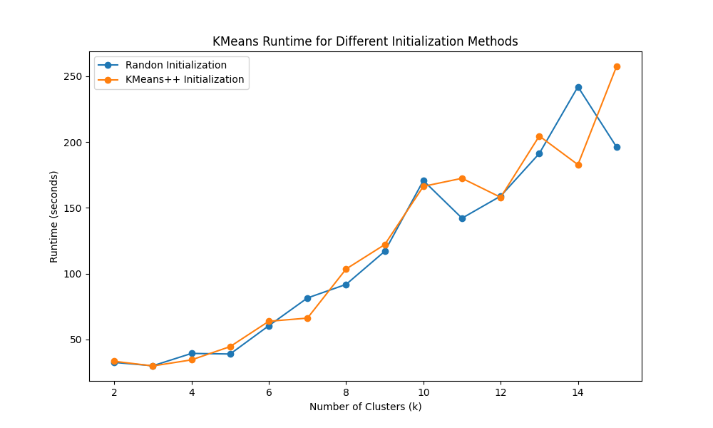

   上圖展示了`n_init = 10`時，`random`和`kmeans++`在不同`k`值下的執行時間對比。從圖中我們可以看出，`kmeans++`在大多時候的執行時間明顯長於`random`，這是因為`kmeans++`在初始化階段需要額外的計算，而`random`則不需要，所以`kmeans++`的執行時間會長於`random`。

   而部分`kmeans++`執行時間較短的情況，可能是因為`kmeans++`在初始化時取得了更好的初始聚類中心，使得後續的迭代次數減少，進而導致執行時間的縮短。

3. 不同`n_init`值下的分群效果

   以下三張圖分別展示了`n_init`在1、5、和10時，`random`和`kmeans++`在不同`k`值下的平均SSE值對比。

   `n_init = 1`
   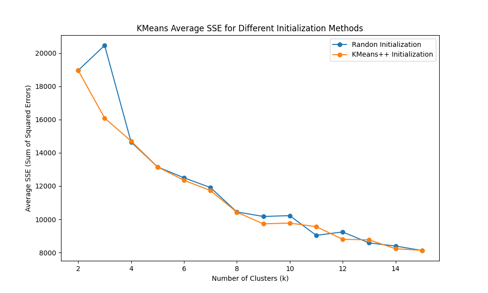

   `n_init = 5`
   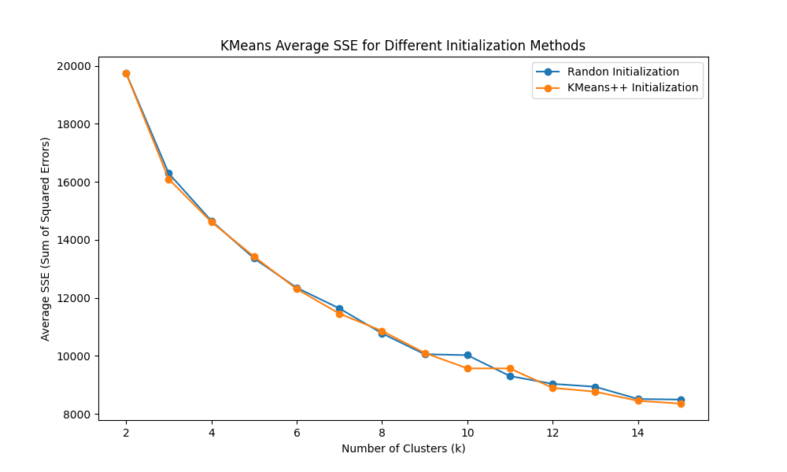

   `n_init = 10`
   

   從這三張圖中我們可以看出，當`n_init`值越大時，`random`和`kmeans++`的平均SSE值越小，並且也越穩定，這是因為隨着K-Means的執行次數增加，其受初始化時的隨機性的影響就越小，所以最終的結果也就越穩定。

   另外，我們也可以觀察到，隨着`n_init`越小，`random`所導致的不穩定性就越大，即更容易導致算法收斂至局部最小值當中，這也進一步證明了`kmeans++`初始化方法在分群上的優越性。

---

#### 比較`Lloyd`與`Elkan`迭代方法的分群性能

1. K-Means 參數設置

   | 參數           | 說明                                                                     |
   | -------------- | ------------------------------------------------------------------------ |
   | `n_clusters`   | 設定為2~10，以探索不同`k`值下`lloyd`與`elkan`對K-Means的性能影響與差異。 |
   | `random_state` | 為消除隨機性所帶來的影響，我將隨機種子固定為17。                         |
   | `n_init`       | 由於隨機種子已經固定，執行多次K-Means取得的結果將相同，故將其設置為1。   |
   | `algorithm`    | 為比較`lloyd`與`elkan`的差異，分別設定為這兩種方法。                     |

2. 不同k值下的分群效果

   下圖分別展示了`lloyd`和`elkan`在不同`k`值下的SSE值與執行時間對比。

   SSE值
   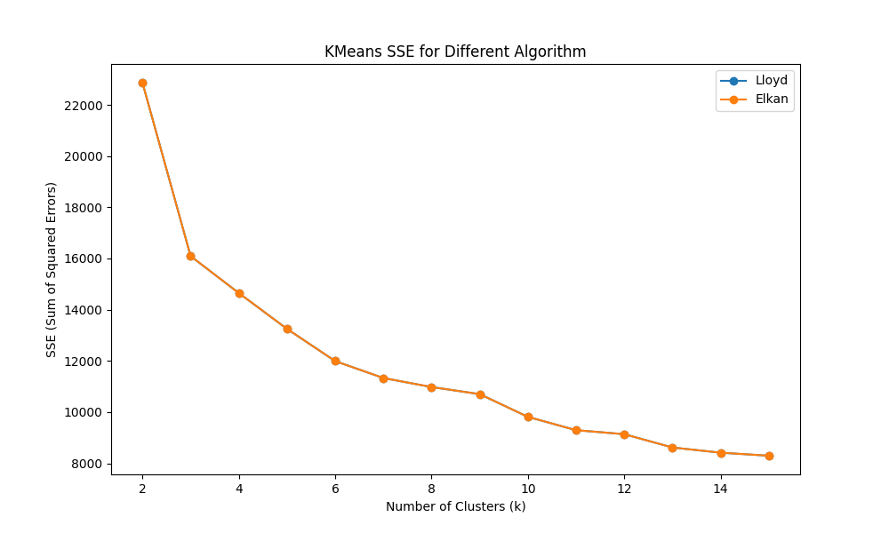

   執行時間
   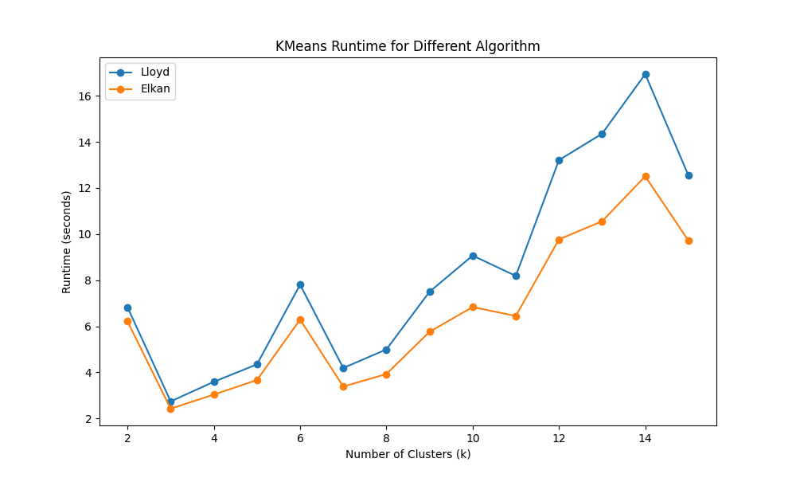

   由於亂數種子和初始化的方法固定，所以從第一張圖中我們可以看到`lloyd`和`elkan`在不同`k`值下的SSE值完全相同，這說明了兩者在分群上的性能並沒有明顯的差異。

   而從第二張圖中我們可以看到，`elkan`在大多數情況下的執行時間都明顯小於`lloyd`，這是因為`elkan`在計算距離時使用了更多的約束，使得其計算距離的次數大幅減少，進而導致執行時間的縮短。換句話說，`elkan`通過更好的距離計算策略，成功地提升了算法的效率，特別是在處理大型資料集或高維度數據時。

---

### 八、Hit song science 分群結果分析與討論

#### K-Means 初始化設置

下表為執行分群時的K-Means初始化設置及其理由說明。

| 參數          | 數值       | 說明                                                                                                                                                      |
| ------------- | ---------- | --------------------------------------------------------------------------------------------------------------------------------------------------------- |
| `n_clusters`  | 10         | 從先前不同`k`值的執行結果中，可以觀察到當`k`值大約在10左右時，SSE值的縮小程度便會開始趨緩，所以我認為將其設置為10應該可以得到較明確且不會過度分群的結果。 |
| `n_init`      | 10         | 執行10次K-Means以消除初始化時的亂數所帶來的影響。                                                                                                         |
| `init_method` | "kmeans++" | 根據先前的結果，我認為使用`kmeans++`來進行初始化可以得到更好的分群效果。                                                                                  |
| `algorithm`   | "elkan"    | 根據先前的結果，`elkan`可以取得更好的執行效率，故設之。                                                                                                   |
| `tolerance`   | 1e-7       | 算法收斂的容忍度，即停止迭代的條件之一。                                                                                                                  |

#### 對所有特徵進行分群

下圖為對Hit song science資料集的所有特徵進行分群後，計算各群`On_chart_ratio`（是否流行的比例）以及群中各特徵平均值後所得的熱力圖，其中顏色由綠到紅代表同列中數值由高到低。

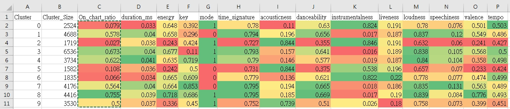

下圖則為各特徵與`On_chart_ratio`的相關係數直條圖：

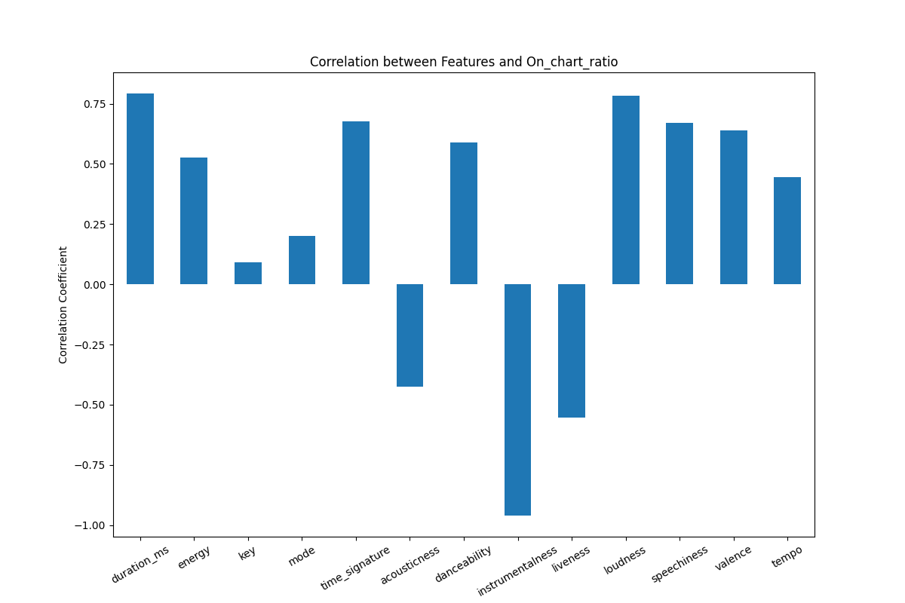

- 相關性較低的特徵

  從圖中可以觀察到，`key`和`mode`與`On_chart_ratio`有著最低的相關性，這可能是因為原先這兩樣特徵屬於Categorical類型，其數值高低更多表示的是樂曲的特性類別而非某種性質的程度，尤其`key`的性質似乎更接近Nominal類型，而非我一開始認爲的Ordinal類型特徵。

  另一方面，`time_signature`和`liveness`因爲資料集中的數值都較為相近，導致不論在哪個群集中都沒有顯著的數值差異，故雖然有著不低的相關性，但其參考性有限。

- 容易流行的特徵組合

  讓我們觀察Cluster 3、4和8，也就是`On_chart_ratio`較高的群集，可以發現它們的特徵數值大致符合相關係數圖中的關係，擁有較高的`energy`、`danceability`、`loudness`、` valence`、以及`tempo`，同時，它們也有較低的`acousticness`和`instrumentalness`。

  這說明了這些群集的音樂特徵傾向於更活潑、節奏感強、音量較大、情感較正向、節奏較快，較少是純音樂，且樂曲風格更傾向電子化的曲目。這樣的特性在一定程度上符合榜上曲目的聽眾偏好，因為這些特徵通常與受歡迎且易於傳播的流行音樂風格相關。

- 較不流行的特徵組合

  觀察Cluster 2和5，也就是`On_chart_ratio`最低的兩個群集，可以發現它們都有着較低的`energy`、`danceability`、`loudness`、`speechiness`、`valence`、`tempo`，以及較高的`acousticness`和`instrumentalness`。

  這類的樂曲呈現較為沉靜、抒情、樂器為主的音樂特徵。這樣的特性可能代表這些群集中的曲目更偏向於傳統的音樂風格，如民謠、古典音樂，而這類型的樂曲在主流音樂市場中的流行程度通常都相對較低。

  另一方面，Cluster 0和6同樣具有較高的`instrumentalness`，但同時也具有較高的`energy`、`danceability`、`loudness`、`valence`、`tempo`，以及較低的`acousticness`，這樣的音樂特性組合通常指向純電子音樂、舞曲或節奏感強烈的音樂類型。它們往往更適和在派對、舞池，或者慶祝等特定場合播放，由於它相對特定的風格，可能在更廣泛的音樂流行度上較為弱勢，尤其在一般流行榜上可能較難取得較高的排名。

---

#### 對歌曲結構相關特徵進行分群

下圖為對Hit song science資料集的歌曲結構相關特徵進行分群後，計算各群`On_chart_ratio`（是否流行的比例）以及群中各特徵平均值後所得的熱力圖，其中顏色由綠到紅代表同列中數值由高到低。

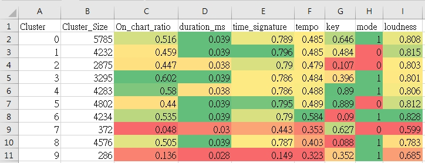

下圖則為各特徵與`On_chart_ratio`的相關係數直條圖：

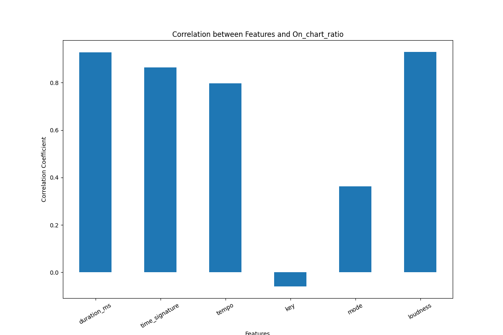

與對所有特徵進行分群的觀察相同，`key`和`mode`與`On_chart_ratio`都有較小的關聯性，以及，流行的樂曲往往都有較高的`tempo`和`loudness`。

另一方面，`duration_ms`與`On_chart_ratio`也有著較高的正相關，這可能是因爲它代表了曲目的完整性，故當其越高時，其流行程度自然也就越高。

---

#### 對音樂特性相關特徵進行分群

下圖為對Hit song science資料集的音樂特性相關特徵進行分群後，計算各群`On_chart_ratio`（是否流行的比例）以及群中各特徵平均值後所得的熱力圖，其中顏色由綠到紅代表同列中數值由高到低。

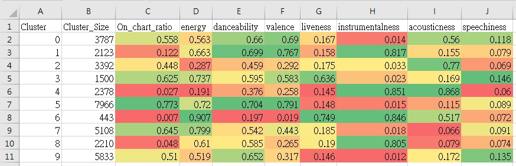

下圖則為各特徵與`On_chart_ratio`的相關係數直條圖：

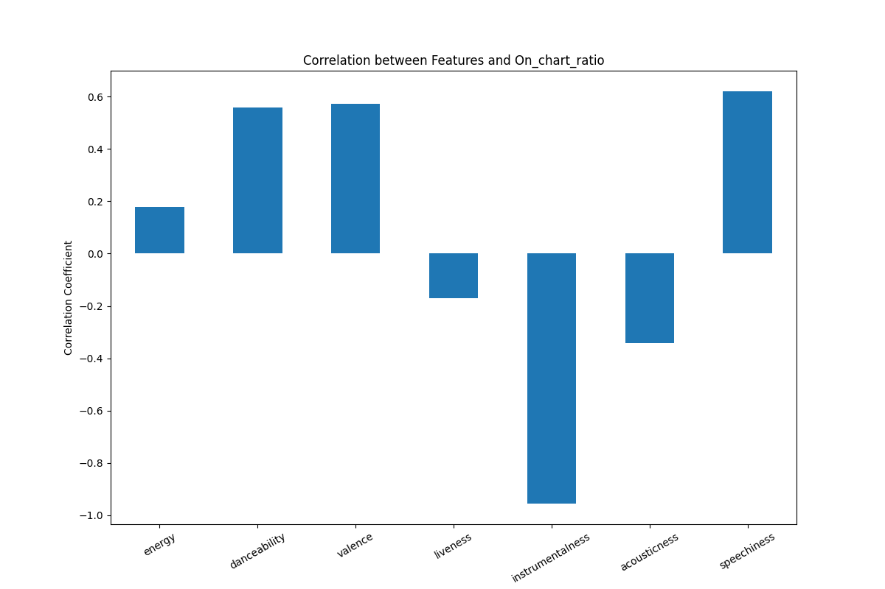

和所有特徵的分群有所不同的是，這裡的`energy`對於流行程度的影響性降低了，觀察所有特徵的分群熱力圖，可以發現`energy`、`valence`、 以及`loudness`的數值分佈情況極其類似，或許是因爲沒有`loudness`的關聯，導致`energy`的影響性降低了。

另一方面，觀察Cluster 6可以發現，它具有較低的`danceability`、`valence`，以及較高的`liveness`和`instrumentalness`，這樣的特徵組合符合一些現場演奏的音樂，包括古典、爵士樂等強調樂器表現和真實演奏的音樂風格。值得注意的是，這類型的音樂通常具有較高的`energy`，但由於是現場演奏，因此同時也具有較低的 loudness。

這些特徵結合在一起，形成了一種獨特的音樂風格，然而，由於其較低的`loudness`和特殊的音樂風格，這類型的樂曲往往難以在流行榜中取得較高的排名。這可能也是爲什麼在這裡`energy`的影響力相對降低的原因，與所有特徵的分群結果不同。

---
